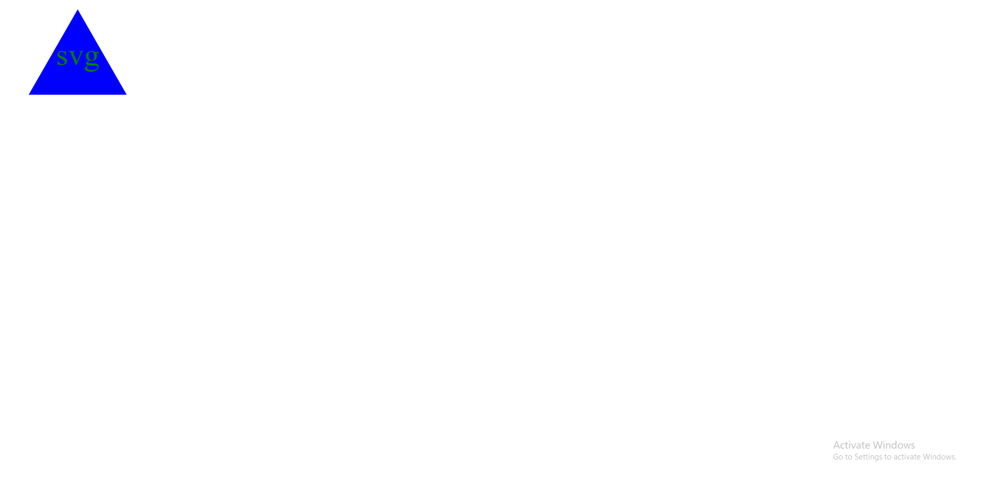

# svg-logo

## Description

In this assignment, I was tasked with writing code that, after prompting the user for a shape, a text, color for the text, and color for the shape, would produce a logo with those parameters.

## License

MIT license

## Screenshots

 

## Link to video

